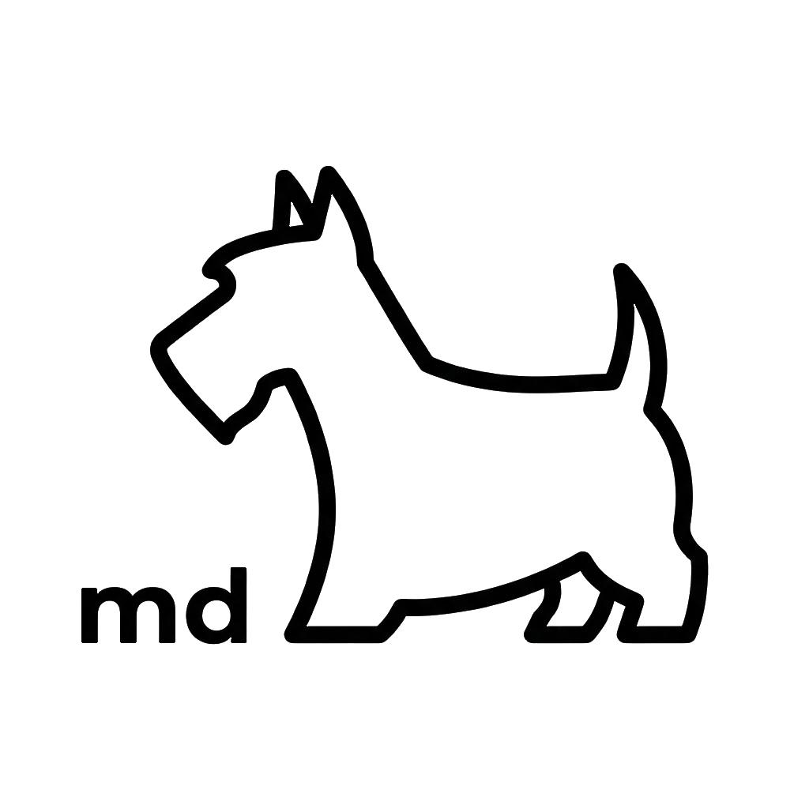

# DOG

<p align="center">
  
</p>

**Documentation Oriented Grammar** — a Markdown-native specification format for system documentation that serves humans and AI agents alike.

Available on [PyPI](https://pypi.org/project/dog-cli/) and as prebuilt binaries on [Releases](https://github.com/AirswitchAsa/dog/releases/latest).

### For coding agents

DOG ships an [Agent Skill](skills/dog/) that teaches coding agents (Claude Code, Cursor, Codex, etc.) how to navigate `.dog.md` specs as the source of truth — query primitives, trace cross-references, and validate changes — instead of guessing from prose. Install once and your agent picks up DOG conventions automatically across projects:

```bash
npx skills install https://github.com/AirswitchAsa/dog/tree/main/skills/dog
```

See [Use with coding agents](#use-with-coding-agents) below for details.

---

## What is DOG?

`.dog.md` files define exactly one **primitive** per file using light Markdown conventions. Cross-references use sigils inside backticks.

| Sigil | Primitive | Purpose                | Required sections                      |
| ----- | --------- | ---------------------- | -------------------------------------- |
| `@`   | Actor     | Who initiates actions  | Description, Notes                     |
| `!`   | Behavior  | What the system does   | Condition, Description, Outcome, Notes |
| `#`   | Component | How it's built         | Description, State, Events, Notes      |
| `&`   | Data      | What's stored          | Description, Fields, Notes             |
|       | Project   | Root index of a docset | Description, Actors, Behaviors, Components, Data, Notes |

Reference syntax: `` `@User` ``, `` `!Login` ``, `` `#AuthService` ``, `` `&Credentials` ``.

See [docs/](docs/) for a full example, and [skills/dog/references/cli.md](skills/dog/references/cli.md) for the CLI reference.

---

## Install

**Prebuilt binary (macOS / Linux):**

```bash
curl -fsSL https://raw.githubusercontent.com/AirswitchAsa/dog/main/scripts/install.sh | sh
```

Drops `dog` into `~/.local/bin`. Override with `DOG_INSTALL_DIR`, pin with `DOG_INSTALL_VERSION=v2026.4.30`.

**PyPI:**

```bash
pip install dog-cli      # or: uv add dog-cli
```

**Windows:** download `dog-windows-x64.exe` from [Releases](https://github.com/AirswitchAsa/dog/releases/latest) and place it on your PATH.

> macOS note: binaries are unsigned. The `curl | sh` installer above works without prompts, but if you download via browser, run `xattr -d com.apple.quarantine ~/.local/bin/dog` once to clear Gatekeeper, or install via `pip` / `uv` instead.

---

## Usage

```bash
dog lint docs/                          # validate structure & refs
dog format docs/                        # normalize whitespace (--check to dry-run)
dog index docs/ --name "My Project"     # generate index.dog.md
dog search "login" -p docs/             # hybrid local search
dog get "@User" -p docs/ --depth 1      # read with resolved refs
dog list -p docs/                       # list all primitives
dog refs "#AuthService" -p docs/        # reverse lookup
dog graph -p docs/ | dot -Tpng -o g.png # dependency graph
dog export -p docs/ > context.json      # bulk JSON export
dog serve docs/                         # browser viewer with hot-reload
```

`search`, `get`, `list`, and `refs` return JSON by default. Use `-o text` for human output. Run `dog <command> --help` for full options.

---

## Use with coding agents

The recommended way is to install the bundled skill so agents discover DOG automatically:

```bash
npx skills install https://github.com/AirswitchAsa/dog/tree/main/skills/dog
```

The skill ([`skills/dog`](skills/dog/)) teaches agents to use `dog`, falling back to `uvx --from dog-cli dog` if the binary isn't installed.

<details>
<summary>System-prompt fallback (for agents without skill support)</summary>

~~~markdown
You are the primary development agent for this codebase, combining expert software engineering with DOG methodology.

## CLI Reference

| Command  | Purpose                                   |
| -------- | ----------------------------------------- |
| `get`    | Read a primitive with resolved refs       |
| `search` | Find primitives with hybrid local search  |
| `list`   | List all primitives (filter: `@!#&`)      |
| `refs`   | Reverse lookup: what references this?     |
| `export` | Bulk export all docs as JSON              |
| `graph`  | DOT output for dependency visualization   |
| `lint`   | Validate structure/refs                   |
| `format` | Normalize whitespace                      |

Tips:
- `get`, `search`, `list`, `refs` return JSON by default; `-o text` for humans
- `dog get <name> --depth 1` includes directly referenced primitives
- `dog search <query> --all` includes low-confidence matches
- Sigil prefixes filter by type: `#`, `!`, `@`, `&`
- `refs` is essential for impact analysis before changes

## Workflow

1. **Understand**: `dog get` + `dog refs` to map dependencies
2. **Design**: document new behaviors before coding
3. **Implement**: code fulfills documented behavior
4. **Validate**: `dog lint docs` passes

Decision guide:
- Bug in code → fix code to match spec
- Bug in spec → fix spec, then code
- Missing docs → document first
- Cross-cutting change → use `dog refs` to find affected docs

Quality gate before completing any task: `dog lint docs` passes, code matches documented Behaviors, terminology is consistent.
~~~

</details>

---

## Build a binary locally

```bash
uv sync --group dev
scripts/build-binary.sh                          # standalone (dist-bin/dog_cli.dist/dog)
DOG_NUITKA_MODE=onefile scripts/build-binary.sh  # single file (dist-bin/dog)
```

Release binaries are produced by the [Release Binaries](.github/workflows/release.yml) workflow on tag push (`v*`) or manual dispatch — matrix-builds onefile binaries for macOS arm64/x64, Linux x64/arm64 (glibc 2.35+), and Windows x64.

---

## Why DOG?

| Approach                | Trade-off                                                                                  |
| ----------------------- | ------------------------------------------------------------------------------------------ |
| RAG / vector search     | Needs embeddings + chunking; context can fragment or miss cross-references.                |
| Traditional prose docs  | Great for humans, hard for LLMs to extract structured knowledge from.                      |
| OpenAPI / JSON Schema   | Excellent for API contracts, but doesn't capture flows, actors, or domain concepts.        |
| **DOG**                 | Markdown-native, no infra. Structured for LLMs, readable for humans. Single source of truth. |

---

## License

MIT
